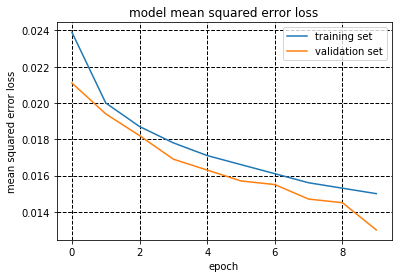

1. visualizing Epoch에 따른 loss 변화
2. 

# **Behavioral Cloning** 

## Writeup Template

### You can use this file as a template for your writeup if you want to submit it as a markdown file, but feel free to use some other method and submit a pdf if you prefer.

---

**Behavioral Cloning Project**

The goals / steps of this project are the following:
* Use the simulator to collect data of good driving behavior
* Build, a convolution neural network in Keras that predicts steering angles from images
* Train and validate the model with a training and validation set
* Test that the model successfully drives around track one without leaving the road
* Summarize the results with a written report

 
[//]: # (Image References)

[image1]: ./images/NvidiaModel.png "Nvidia_Model"
[image2]: ./images/rgb.png "RGB"
[image3]: ./images/cropped.png "Cropped"
[image4]: ./images/resized.png "Resized"
[image5]: ./images/epochs_loss.png "Loss"

[image2]: ./examples/placeholder.png "Grayscaling"
[image3]: ./examples/placeholder_small.png "Recovery Image"
[image4]: ./examples/placeholder_small.png "Recovery Image"
[image5]: ./examples/placeholder_small.png "Recovery Image"
[image6]: ./examples/placeholder_small.png "Normal Image"
[image7]: ./examples/placeholder_small.png "Flipped Image"

## Rubric Points

Here I will consider the [rubric points](https://review.udacity.com/#!/rubrics/432/view) individually and describe how I addressed each point in my implementation.  

---
### Files Submitted & Code Quality

#### 1. Submission includes all required files and can be used to run the simulator in autonomous mode

My project includes the following files:
* model.py containing the script to create and train the model
* drive.py for driving the car in autonomous mode
* model.h5 containing a trained convolution neural network 
* writeup_report.md or writeup_report.pdf summarizing the results

#### 2. Submission includes functional code
Using the Udacity provided simulator and my drive.py file, the car can be driven autonomously around the track by executing 
```sh
python drive.py model.h5
```

#### 3. Submission code is usable and readable

The model.py file contains the code for training and saving the convolution neural network. The file shows the pipeline I used for training and validating the model, and it contains comments to explain how the code works.

### Model Architecture and Training Strategy

#### 1. An appropriate model architecture has been employed

The fundamental model that I tried to design for this project comes from a well-known convolutional neural network which was officially introduced by [Nvidia Autonomous Car Group](https://devblogs.nvidia.com/parallelforall/deep-learning-self-driving-cars/) for End-to-End driving. 
This model is used because of its simplicity and demonstrated ability to perform well on self-driving car tasks. The base architecture is as below.

![Nvidia_Model][image1]


#### 2. Attempts to reduce overfitting in the model

To overcome overfitting problem, I used several techniques for data augmentation such as flipping images horizontally, using three images from different views(center, left, right), and applying dropout layers to help the model generalize (model.py lines **).
 
To ensure that the model was not overfitting, the model was trained and validated on different data sets(80%: training set, 20%: validation set). Finally, the model was successfully tested by running it through the simulator and ensuring that the vehicle could stay on the track.


#### 3. Model parameter tuning

Most of model parameters such as kernel size(5x5, 3x3), strides(2x2, 1x1), depth(24, 36, 48, 64, 64) were tuned same as Nvidia already suggested.
The batch size was set to 128, and epochs=3 was good enough to perform well. 
The model used an adam optimizer, so that the learning rate was not tuned manually (model.py line **).
Mean Square Error(MSE) is used for loss function.
For dropout, keep probabilies are all set to 0.7.

#### 4. Appropriate training data

Training data was chosen to keep the vehicle driving on the road. I first tested the model with the data provided by Udacity, and felt that it is not good enough when the curvature is very large. Then, I collected my own data for center lane driving, recovering from the left and right sides of the road from all three different cameras.
As the simulator provides three different images taken from center, left, right cameras, all those images are appropriately used to train the model.

For details about how I created the training data, see the next section. 

### Model Architecture and Training Strategy

#### 1. Solution Design Approach

The overall strategy for deriving a model architecture was to read the Nvidia [paper](https://images.nvidia.com/content/tegra/automotive/images/2016/solutions/pdf/end-to-end-dl-using-px.pdf) and utilize the architecture since it has been proven to be very successful in real world self-driving car tasks. It was also recommended during the lesson.

In order to gauge how well the model was working, I split my image and steering angle data into a training and validation set. I found that my first model had a low mean squared error on the training set but a high mean squared error on the validation set. This implied that the model was overfitting. 

The official [paper](https://devblogs.nvidia.com/parallelforall/deep-learning-self-driving-cars/) does not mention any sort of means to reduce overfitting problem, so that I just gave a first try adding 'Batch Normalization' layer in every convolutional and fully-connected layer of the network. Despite the fact that I was not very clear with the mechanism of Batch Normalization, as proposed in the [paper](https://arxiv.org/abs/1502.03167), Batch Normalization can act as a regularizer, also allowing us to use much higher learning rate and being less careful about initialization.
In the beginning, it seemed working well with the low level of validation loss, which was around 0.0187, but it didn't go very well with the simulation test. There were a few spots where the vehicle repeatly fell off the track, departing the lane and ending up with falling into the lake.

To improve the driving behavior in these cases, as a substitue of Batch Normalization, I decided to add dropout layers with 30% drop-rate placing in each Convolutional layer right after the activation functions, ReLU, are applied. At the end of the process, I found the vehicle being able to complete the track without any lane departure. I may need to search for what's the core difference between batch normalization and dropout though.


#### 2. Final Model Architecture


The final model architecture (NvidiaModel.py) consists of 9 layers, including a Lambda layer for normalization, 5 convolutional layers, and 3 fully-connected layers. The input 70x160x3 YUV images are passed to the network and the overall architecutre looks like as below.


--visualization 추가하기
Here is a visualization of the architecture (note: visualizing the architecture is optional according to the project rubric)

<table>
    <tr>
        <th>STEP</th>
        <th>LAYER</th>
        <th>IN. SIZE</th>
        <th>OUT. SIZE</th>
        <th>DESCRIPTION</th>
    </tr>
    <tr>
        <td>Input image</td>
        <td></td>
        <td>70 × 160 × 3</td>
        <td>70 × 160 × 3</td>
        <td>70 × 160 × 3 YUV image</td>
    </tr>
    <tr>
        <td>Lamda layer</td>
        <td></td>
        <td>70 × 160 × 3</td>
        <td>70 × 160 × 3</td>
        <td>data normalization: x/127.5 -1</td>
    </tr>
    <tr>
        <td rowspan="3">Convolution 1</td>
        <td>Convolution 5 × 5 @24</td>
        <td>70 × 160 × 3</td>
        <td>33 × 78 × 24</td>
        <td>2 × 2 stride, VALID padding</td>
    </tr>
    <tr>
        <td>ReLU</td>
        <td>33 × 78 × 24</td>
        <td>33 × 78 × 24</td>
        <td></td>
    </tr>
    <tr>
        <td>Dropout</td>
        <td>33 × 78 × 24</td>
        <td>33 × 78 × 24</td>
        <td>0.7 keep rate</td>
    </tr>
    <tr>
        <td rowspan="3">Convolution 2</td>
        <td>Convolution 5 × 5 @36</td>
        <td>33 × 78 × 24</td>
        <td>15 × 37 × 36</td>
        <td>2 × 2 stride, VALID padding</td>
    </tr>
    <tr>
        <td>ReLU</td>
        <td>15 × 37 × 36</td>
        <td>15 × 37 × 36</td>
        <td></td>
    </tr>
    <tr>
        <td>Dropout</td>
        <td>15 × 37 × 36</td>
        <td>15 × 37 × 36</td>
        <td>0.7 keep rate</td>
    </tr>
    <tr>
        <td rowspan="3">Convolution 3</td>
        <td>Convolution 5 × 5 @48</td>
        <td>15 × 37 × 36</td>
        <td>6 × 17 × 48</td>
        <td>2 × 2 stride, VALID padding</td>
    </tr>
    <tr>
        <td>ReLU</td>
        <td>6 × 17 × 48</td>
        <td>6 × 17 × 48</td>
        <td></td>
    </tr>
    <tr>
        <td>Dropout</td>
        <td>6 × 17 × 48</td>
        <td>6 × 17 × 48</td>
        <td>0.7 keep rate</td>
    </tr>
    <tr>
        <td rowspan="3">Convolution 4</td>
        <td>Convolution 3 × 3 @64</td>
        <td>6 × 17 × 48</td>
        <td>5 × 16 × 64</td>
        <td>1 × 1 stride, VALID padding</td>
    </tr>
    <tr>
        <td>ReLU</td>
        <td>5 × 16 × 64</td>
        <td>5 × 16 × 64</td>
        <td></td>
    </tr>
    <tr>
        <td>Dropout</td>
        <td>5 × 16 × 64</td>
        <td>5 × 16 × 64</td>
        <td>0.7 keep rate</td>
    </tr>
    <tr>
        <td rowspan="3">Convolution 5</td>
        <td>Convolution 3 × 3 @64</td>
        <td>5 × 16 × 64</td>
        <td>4 × 15 × 64</td>
        <td>1 × 1 stride, VALID padding</td>
    </tr>
    <tr>
        <td>ReLU</td>
        <td>4 × 15 × 64</td>
        <td>4 × 15 × 64</td>
        <td></td>
    </tr>
    <tr>
        <td>Dropout</td>
        <td>4 × 15 × 64</td>
        <td>4 × 15 × 64</td>
        <td>0.7 keep rate</td>
    </tr>
    <tr>
        <td>Flattening</td>
        <td>Flatten</td>
        <td>4 × 15 × 64</td>
        <td>1 × 3840</td>
        <td></td>
    </tr>
    <tr>
        <td rowspan="2">Fully Connected 1</td>
        <td>Fully connected</td>
        <td>1 × 3840</td>
        <td>1 × 100</td>
        <td></td>
    </tr>
    <tr>
        <td>ReLU</td>
        <td>1 × 100</td>
        <td>1 × 100</td>
        <td></td>
    </tr>
    <tr>
        <td rowspan="2">Fully Connected 2</td>
        <td>Fully connected</td>
        <td>1 × 100</td>
        <td>1 × 50</td>
        <td></td>
    </tr>
    <tr>
        <td>ReLU</td>
        <td>1 × 50</td>
        <td>1 × 50</td>
        <td></td>
    </tr>
    <tr>
    <tr>
        <td rowspan="2">Fully Connected 3</td>
        <td>Fully connected</td>
        <td>1 × 50</td>
        <td>1 × 10</td>
        <td></td>
    </tr>
    <tr>
        <td>ReLU</td>
        <td>1 × 10</td>
        <td>1 × 10</td>
        <td></td>
    </tr>
    <tr>
        <td rowspan="1">Output layer</td>
        <td>Fully connected</td>
        <td>1 × 10</td>
        <td>1 × 1</td>
        <td></td>
    </tr>

</table>


#### 3. Creation of the Training Set & Training Process

The model only learns from the data I give it, so a good variety is key to getting it to behave predictably.

To capture good driving behavior, following 4 types of training images are used.
1. Center camera image
2. Center camera image flipped horizontally
3. Left camera image
4. Right camera image 

The captured training images don't fit right into the CNN, so some preprocessing was essentially required.
There are Five image preprocessing works I have done: cropping, resizing, blurring, flipping, converting the color space into YUV

First, images produced by the simulator in training modes are 160x320x3, and therefore they need do be resized to proper size prior to being fed to the CNN.
This model expects input images to be size 70x160x3. To achieve this, the bottom 30 pixels and the top 60 pixels are cropped from the image and it is resized to size 70x160x3. A subtle Gaussian blur is also applied before resizing, and the color space is converted from RGB to YUV(as the [paper](https://devblogs.nvidia.com/parallelforall/deep-learning-self-driving-cars/) suggested). Because drive.py used the same CNN Model to predict steering angles in real time, it definitely needs to be done with same image processing (NOTE: as model.py uses cv2.imread(), its conversion is BGR to YUV while drive.py converts from RGB to YUV). 

To balance out the dataset with non-zero steering angles, I also applied a correction of factor +,- 0.2 to the steering angle for left and right camera images. Because most steering angles from each camera were heavily biased towards 0.0 angle, this correction technique offsets this problem well.

Lastly, as the track 1 is severely biased toward left and zero turning(straight), I applied flipping to some center camera images, which has a constraint that steering angle is larger than 0.2. For those images, the opposite of steering angle(-1 * steering_angle) was added.

Then, those all processed images are normalized in Lambda layer using x/127.5 -1 to be fed into the convolutional layers.

### Original image


### Cropped


### Resized to 160x70


I had total 39493 number of data points, which were all collected by myself, and they were split into a training and validation set. 
Then the data set were randomly shuffled and 20% of the data were put into a validation set. 
I used this training data for training the model. The validation set helped determine if the model was over or under fitting. The graph below shows how training loss and validation loss in each epoch changes.

### Loss


After this training, the model was tested on the first track to ensure the model performs as expected.


